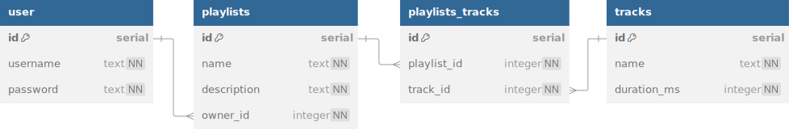

# Jukebox Pro

Introducing Jukebox Pro, the successor to Jukebox! Users will now need to make an account
and log in before they are able to manage their playlists.

This workshop starts at the solution of the previous workshop! Your task is to update the
code to incorporate the new account features.

## Database



<details>
<summary>See DBML</summary>

```dbml
table user {
  id serial [pk]
  username text [unique, not null]
  password text [not null]
}

table playlists {
  id serial [pk]
  name text [not null]
  description text [not null]
  user_id integer [not null]
}

table playlists_tracks {
  id serial [pk]
  playlist_id integer [not null]
  track_id integer [not null]

  indexes {
    (playlist_id, track_id) [unique]
  }
}

table tracks {
  id serial [pk]
  name text [not null]
  duration_ms integer [not null]
}

Ref: user.id < playlists.user_id
Ref: playlists.id < playlists_tracks.playlist_id
Ref: tracks.id < playlists_tracks.track_id
```

</details>

1. Create the `users` table in `schema.sql`.
   - The `username` field is unique.
2. Add the `user_id` field to the `playlists` table.
   - User deletion should cascade to related playlists.
3. Update the seed file to additionally seed at least 2 users.
   Each user should have a playlist containing at least 5 tracks.
   You will have to edit how playlists are seeded as well, since
   they now are required to belong to a user!

## Server

Once your database is properly seeded, add or refactor the following endpoints.
Remember to send appropriate status codes and error messages! You can use `npm
run test` to check your work as you build out these endpoints.

The 🔒lock icon next to a route indicates that it must be a protected route. A client can
only access that route by attaching a valid token to their request. If a valid token is
not provided, immediately send a 401 Unauthorized error.

`/users` router

- `POST /users/register`
  - sends 400 if request body is missing username or password
  - creates a new user with the provided credentials
    - make sure passwords are hashed!
  - creates and sends a token with the ID of the created user
- `POST /users/login`
  - sends 400 if request body is missing username or password
  - sends a token if the provided credentials are valid

🔒`/playlists` router

- 🔒All `/playlists` routes now require the user to be logged in.
- `GET /playlists` sends array of all playlists owned by the user.
- `POST /playlists` creates a new playlist owned by the user.
- `GET /playlists/:id` sends 403 error if the user does not own the playlist.
- `GET /playlists/:id/tracks` sends 403 error if the user does not own the playlist.

`/tracks` router

- 🔒`GET /tracks/:id/playlists` sends all playlists owned by the user that contain this
  track.
